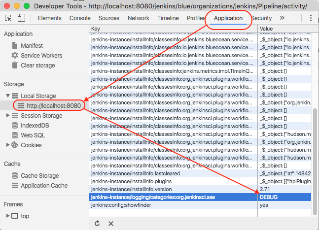
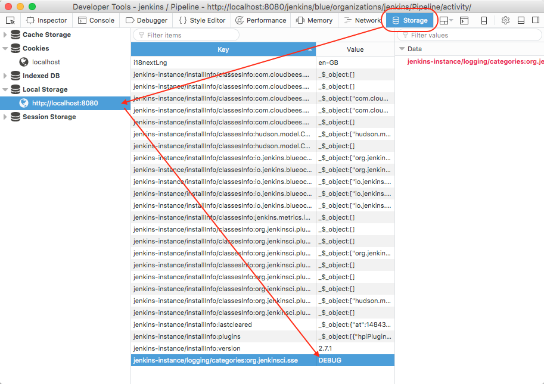
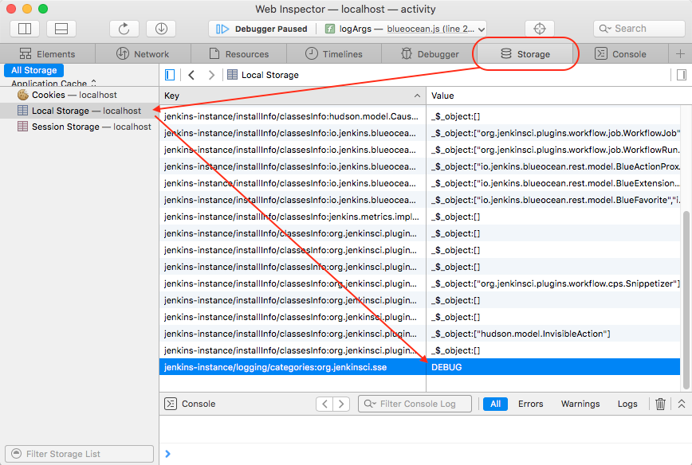

Client-side Logging APIs for Jenkins.

<hr />

# API

This API supports <u>_hierarchical logging categories_</u> i.e. if the log [Level] for a category is not configured (see [setLogLevel]), the log [Level] for that category will come from the "dot parent" category i.e. if you create a logger for category "`a.b.c`", but "`a.b.c`" is not configured with a log [Level], it will check and use the log level configured on "`a.b`" etc.

## logger(category)
Create a [Logger] instance for logging to the specified category.

* <u>category</u>: The log category for the logger. See above notes on _hierarchical logging categories_. 

__Note__: The [Logger] instance will default to [Level.ERROR] if the category is not configured (and none of it's "dot parents").

```javascript
const logging = require('@jenkins-cd/logging');
const logger = logging.logger('org.jenkinsci.sse');

// Log messages ...
if (logger.isDebugEnabled()) {
    logger.debug('Log a message for x and y values: ', x , y);
}
```

See the [Logger] class for detail on the [Logger] methods.
 
## setLogLevel(category, [level])
Set the logging [Level] for the specified log category. 

* <u>category</u>: The log category to be configured. See above notes on _hierarchical logging categories_. 
* <u>level</u>: The log [Level].

This function is intended for use by browser tooling (e.g. Chrome Developer Extension) for configuring the log levels.

```javascript
const logging = require('@jenkins-cd/logging');

logging.setLogLevel('org.jenkinsci.sse', logging.Level.DEBUG);
```
 
See the "Browser Configuration" section below for information on how to discover and configure log levels in the browser.
 
## getCategoriesStorageNS
Get the [`StorageNamespace`](https://www.npmjs.com/package/@jenkins-cd/storage) used to store log level configurations.

This function is intended for use by browser tooling (e.g. Chrome Developer Extension) for configuring the log levels.

<hr id="browser-config" />

# Browser Configuration

We might, at some time in the future, create Developer tool Extensions for one or more browsers, making it easy to discover and configure log levels. In the meantime however, you need to be able to discover and configure them yourself.

This logging package uses browser [`localStorage`](https://developer.mozilla.org/en/docs/Web/API/Window/localStorage) for storing log settings. So while of course it's possible to use the Developer Console in any browser to set log levels via the [Storage API](https://developer.mozilla.org/en-US/docs/Web/API/Storage), it actually turns out that most browsers have a "Storage Inspector" within their Developer tools, making it very easy to find and configure logging levels without having to write instructions into a Browser Dev Console.  

Configuring log levels in the Storage Inspector of any of the Browsers is a simple process of locating the key for the log category of interest (all log category keys have a "`jenkins-instance/logging/categories:`" prefix) and changing it's value to the desired [Level] i.e. `DEBUG`, `LOG`, `INFO`, `WARN`, `ERROR`. See the following sections for specific examples. 

## Google Chrome

The following image shows Google Chrome's Storage inspector. 



## Firefox

The following image shows Firefox's Storage inspector. Note that the Storage Inspector in Firefox is not enabled by default, so you'll need to enable it [in the Developer tools Settings](./images/firefox-settings.png) if it's not already enabled. 



Note that Firefox has a useful "filter" field for narrowing the visible set of stored name/value pairs. Enter "jenkins-instance/logging/categories".

## Safari

The following image shows Safari's Storage inspector. Note that the Developer tools in Safari is not enabled by default (and therefore the Storage Inspector), so you'll need to enable it [in the Advanced section of the Browser Settings](./images/safari-settings.png) if it's not already enabled. 



<a href="https://github.com/tfennelly/jenkins-js-logging" target="_blank"></a>

[Level]: ./Level.html
[Level.ERROR]: ./Level.html#ERROR
[Logger]: ./Logger.html
[setLogLevel]: ./global.html#setLogLevel
[@jenkins-cd/storage]: https://www.npmjs.com/package/@jenkins-cd/storage